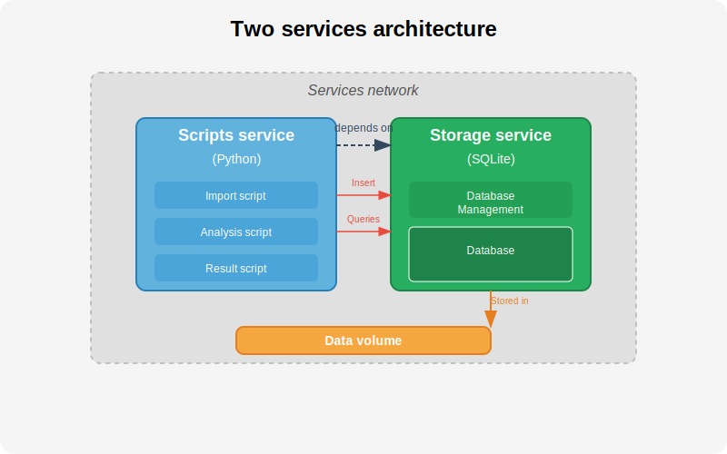
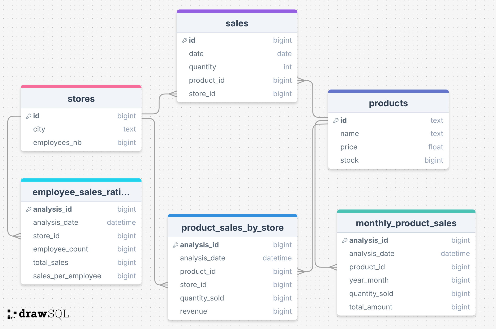
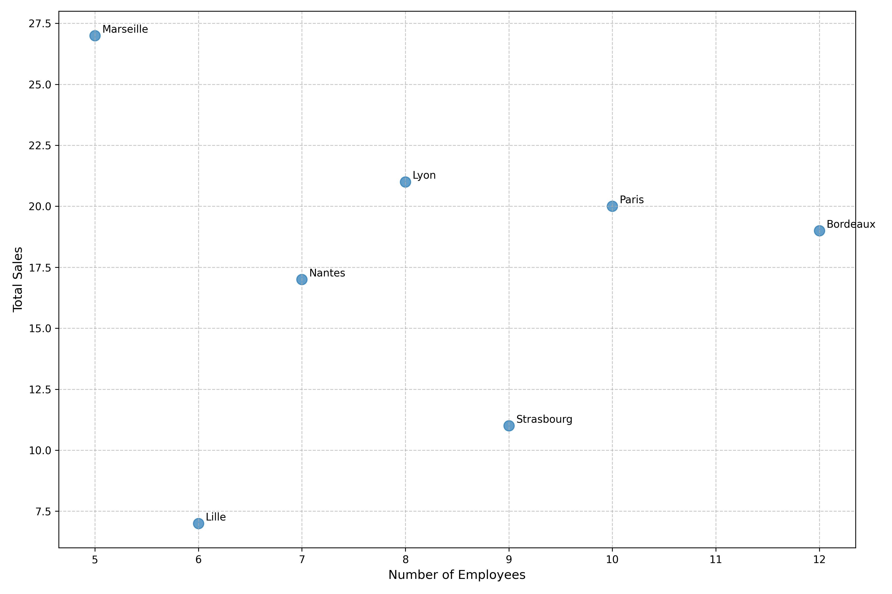
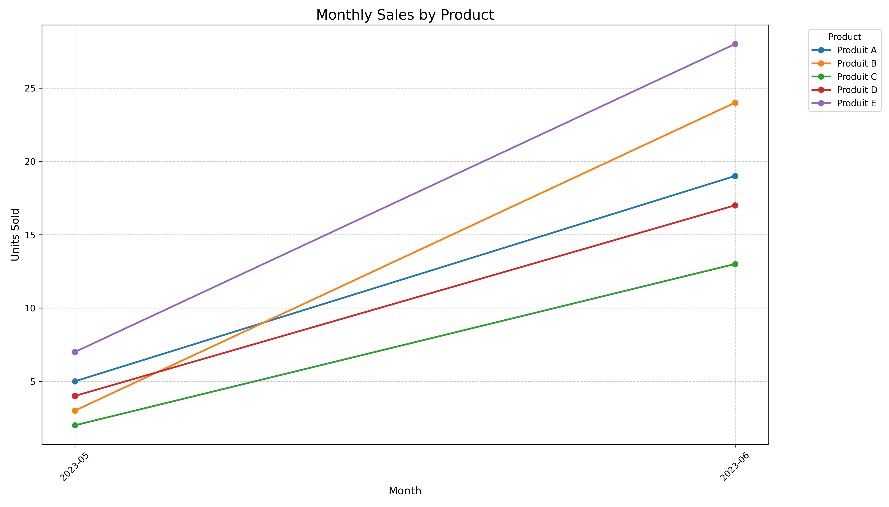
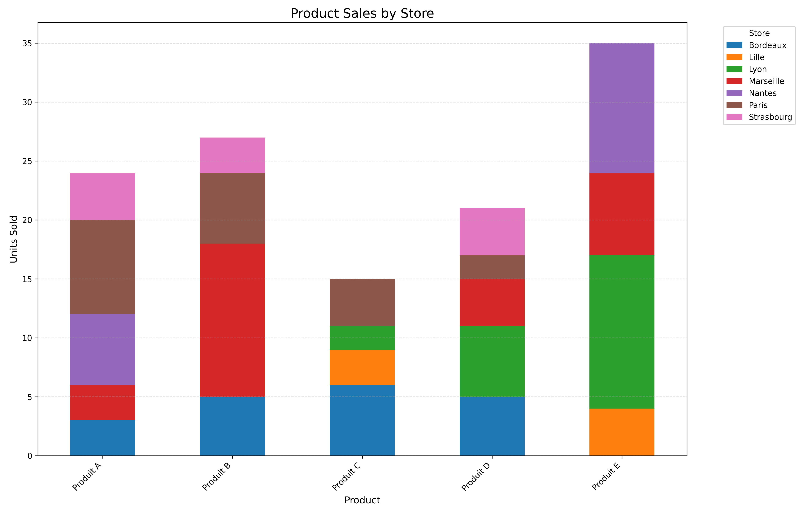

# Sales Analysis System

This project implements a sales analysis system for a small to medium-sized business. It processes sales data to provide insights into product performance, store efficiency, and sales trends.

## Architecture

The system is built using a two-service architecture:

### Script Execution Service (Python)
This service is responsible for:
- Importing data from CSV files
- Processing and analyzing sales data
- Storing analysis results in the database

The service is built from a custom Docker image using Python 3.12 on a slim Debian base. It contains modules for:
- Database setup and connection management
- Data import from CSV files
- Data analysis and reporting



### Database Service (SQLite)
This service provides:
- Persistent storage for sales data
- Storage for analysis results
- Data retrieval capabilities

The service uses the `keinos/sqlite3:latest` image, which is an Alpine-based implementation of SQLite3 with support for both AMD and ARM architectures.

## Database Schema

The database consists of the following tables:
- **Products**: Stores product information
- **Stores**: Contains store details and location data
- **Sales**: Records all sales transactions
- **Analysis tables**: Multiple tables for storing analysis results

Each analysis table is designed for a specific type of analysis:
- **product_sales_by_store**: Tracks product sales performance by store
- **monthly_product_sales**: Monitors product sales trends by month
- **employee_sales_ratio**: Analyzes the relationship between employee count and sales



## Setup and Installation

### Prerequisites
- Docker and Docker Compose
- Access to product, store, and sales data files

### Running the System
1. Clone this repository
2. Place your CSV data files in the `data/` directory
3. Build and start the services:
   ```bash
   docker-compose up --build
   docker-compose up --build -d (to detach)

   ```

## Data Analysis Results

### Visualizations

#### Employee Sales Correlation


This scatter plot illustrates the relationship between the number of employees and total sales across different store locations. Each point represents a store, with the x-axis showing the number of employees and the y-axis representing total sales. The dotted red line indicates the linear regression trend, helping to visualize any correlation between employee count and sales performance.

Key observations:
- Marseille seems to have the highest number of employees with significant sales
- Most stores cluster around 6-10 employees
- There appears to be a positive correlation between employee count and sales

#### Monthly Sales by Product


This line graph tracks the monthly sales performance of the top 5 products over two months (2023-05 to 2023-06). Each colored line represents a different product, showing its sales trajectory.

Key insights:
- Produit E (purple) shows the highest sales and steepest growth
- All products demonstrate a general upward sales trend
- The rate of sales increase varies between products

#### Product Sales by Store


A stacked bar chart displaying product sales distribution across different store locations. Each bar represents a product, and the colored segments show sales volumes in each store.

Key takeaways:
- Produit E has the highest total sales across stores
- Sales distribution varies significantly between products and stores
- Some products perform better in specific locations

## Development

### Project Structure
```
project/
├── data/                        # Data files
├── docs/                        # Architecture and db schema
├── dataviz/                     # Dataviz png files
├── scripts/                     # Python scripts
│   ├── database.py              # Database setup
│   ├── data_import.py           # Data import functions
│   ├── data_visualization.py    # Dataviz functions
│   └── data_analysis.py         # Data analysis functions
├── models/                      # Database models
│   ├── base.py                  # Base SQLAlchemy model
│   ├── products.py              # Products model
│   ├── stores.py                # Stores model
│   ├── sales.py                 # Sales model
│   ├── employee_sales_ratios.py # Analysis model
│   ├── monthly_product_sales.py # Analysis model
│   └── product_sales_by_store   # Analysis model
├── main.py                      # Main entry point script
├── Dockerfile                   # Docker image definition
├── docker-compose.yml           # Service configuration
└── requirements.txt             # Python dependencies
```

### Adding New Analyses
To add a new analysis:
1. Create a new model in the `models/` directory
2. Add the model to `models/__init__.py`
3. Implement the analysis logic in `scripts/data_analysis.py`
4. Update the main script to include the new analysis